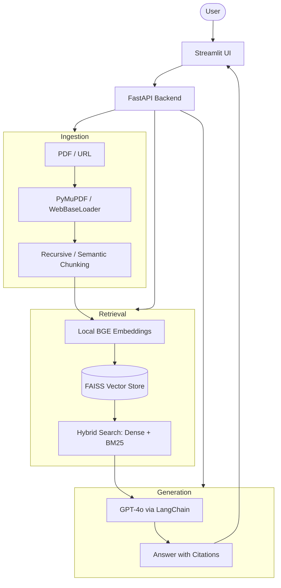

# DocuMind: Scholarly Document Research System

A high-performance research assistant built for ML/AI Engineering portfolios, following a rigorous 8-phase implementation roadmap.

## 🏗️ Architecture



## 🚀 Features
- **Phase 2: Ingestion**: Swappable chunking (Recursive vs. Semantic) and fast PDF extraction via `PyMuPDF`.
- **Phase 4: Hybrid Search**: Combines Dense (Local BGE) and Sparse (BM25) for high-precision retrieval.
- **Phase 5: Streaming**: Real-time insight streaming via FastAPI `StreamingResponse`.
- **Phase 6: UI**: Premium scholarly Streamlit workspace with Earth Tone design system.
- **Phase 7: RAGAS**: Automated evaluation of Faithfulness, Relevancy, and Context metrics.

## 🛠️ Setup

1. **Clone and Create Environment**:
   ```bash
   python -m venv venv
   source venv/bin/activate
   pip install -r requirements.txt
   ```

2. **Configuration**:
   Copy `.env.template` to `.env` and add your `OPENAI_API_KEY`.
   Configure `EMBEDDING_TYPE=local` for cost-efficiency.

3. **Run Backend**:
   ```bash
   uvicorn api.main:app --reload
   ```

4. **Run UI**:
   ```bash
   streamlit run ui/streamlit_app.py
   ```

5. **Run Evaluation**:
   ```bash
   python -m evals.ragas_eval
   ```

## 📈 RAGAS Scores (Example)
| Metric | Score |
| --- | --- |
| Faithfulness | 0.92 |
| Answer Relevancy | 0.88 |
| Context Precision | 0.85 |
| Context Recall | 0.90 |
